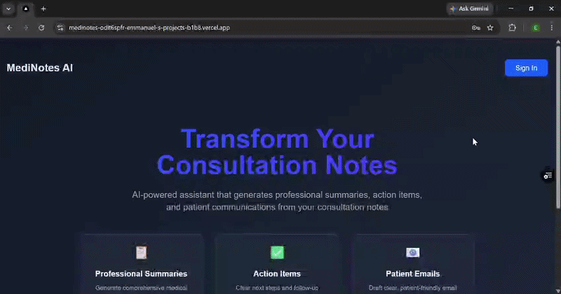

# MediNotes AI

A full-stack healthcare consultation assistant that turns a doctor's consultation notes into:

- a structured summary for medical records
- clear follow-up actions for the doctor
- a patient-friendly email draft

**Live Demo:** https://medinotes-ai.vercel.app

The project started as a simple LLM web application and was progressively expanded with authentication, paid access, streaming responses, structured form input and backend validation. Docker containerisation and AWS deployment are the next stage of development.

## Walkthrough



The walkthrough shows the current MediNotes AI flow:

- Sign in to the application
- Enter synthetic consultation notes
- Generate a consultation summary
- Generate follow-up actions for the doctor
- Generate a patient-friendly email
- Access the subscription-protected application


> **Development Status**
>
> MediNotes AI is currently under active development and is being tested using synthetic data only.
>
> The application is not yet intended for use with real patient information or for clinical decision-making. Before any production healthcare use, additional safeguards would be required, including appropriate regulatory compliance, stronger access controls, audit logging, encryption, data retention policies, patient consent processes, and secure third-party service agreements.
>
> The long-term goal is to develop MediNotes AI into a production-ready healthcare application that can support clinicians with consultation documentation and patient communication.

---

## What the Application Does

A signed-in user can enter:

- Patient name
- Date of visit
- Consultation notes

The application sends the information to a FastAPI backend, which validates the request and sends a structured prompt to the OpenAI API.

The response is streamed back to the browser and displayed in three sections:

1. **Summary of visit for the doctor's records**
2. **Next steps for the doctor**
3. **Draft of email to patient in patient-friendly language**

The application also includes user authentication and subscription-based access.

---

## Tech Stack

### Frontend

- Next.js
- React
- TypeScript
- Tailwind CSS
- React Markdown
- React DatePicker

### Backend

- Python
- FastAPI
- Pydantic
- OpenAI API
- Server-Sent Events

### Authentication and Billing

- Clerk authentication
- JWT-based API authentication
- Clerk subscriptions
- Protected premium access

### Deployment

- Vercel

### Planned Infrastructure

- Docker
- Amazon ECR
- AWS Lambda
- AWS Lambda Web Adapter
- Lambda Function URLs
- Amazon CloudWatch

---

## Project Structure

```
medinotes-ai/
├── api/
│   └── index.py
│
├── docs/
│   └── screenshots/
│       ├── 01-medinotes-ai-landing-page.png
│       ├── 02-consultation-form-synthetic-data.png
│       ├── 03-generated-consultation-summary.png
│       ├── 04-doctor-actions-and-patient-email.png
│       ├── 05-patient-email-output.png
│       ├── 06-clerk-subscription-billing.png
│       └── medinotes-ai-demo.gif
│
├── pages/
│   ├── _app.tsx
│   ├── _document.tsx
│   ├── index.tsx
│   └── product.tsx
│
├── public/
│
├── styles/
│   └── globals.css
│
├── .gitignore
├── next.config.ts
├── package.json
├── package-lock.json
├── requirements.txt
├── tsconfig.json
└── README.md


```